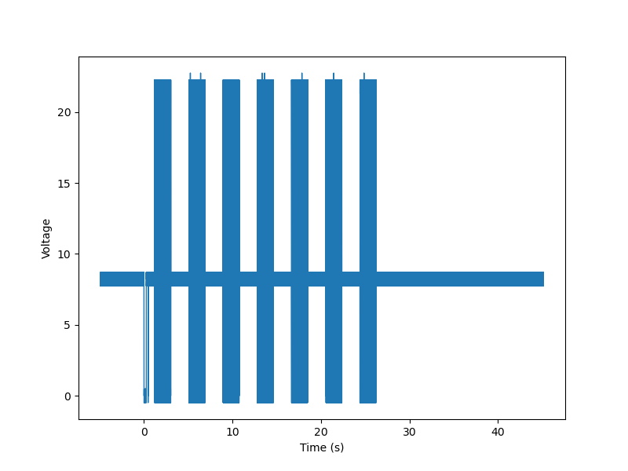
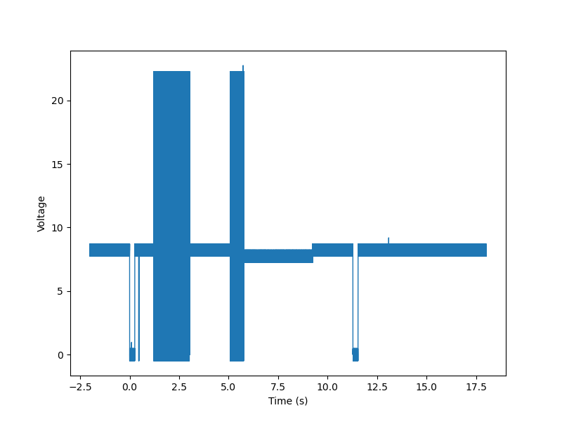
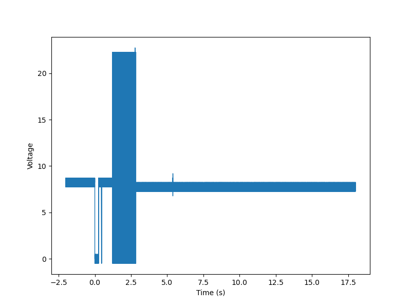
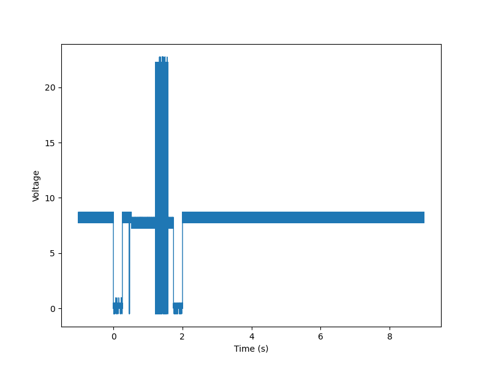
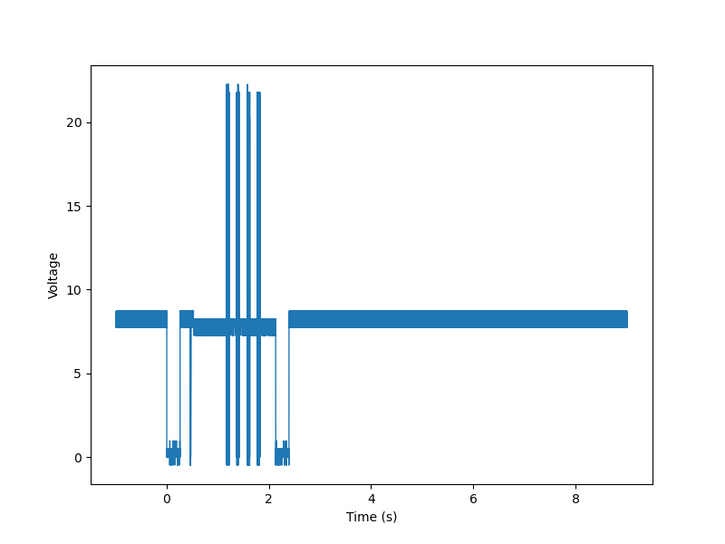
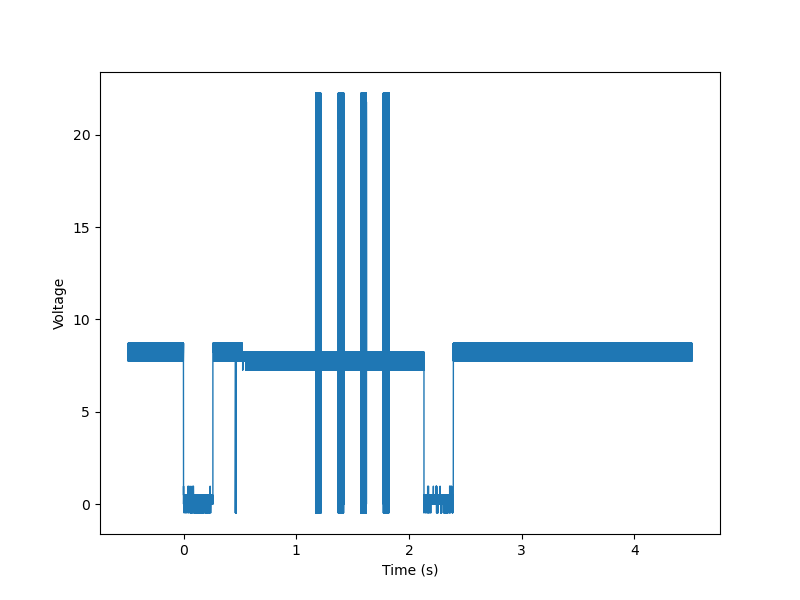
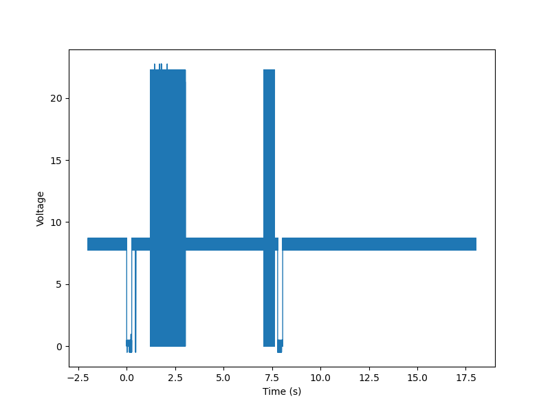

# Data captures from Proel&trade; intercom exchange line

## Captures done with Rigol MSO5345

Raw captures (no logic level translation) made with Rigol MSO5354 in zipped CSV format.

DS0 - flat 44: long ring, no pick up, no open.

DS1 - flat 44: ring, pick up, "hello", no open.

DS2 - flat 44: ring, pick up, "hello", open.

DS3 - flat 44: ring, stopped with the entrance keyboard.

DS4 - flat 44: open the door using a code.

DS5 - flat 44: open the door using a wireless keyfob.

DS6 - flat 38: ring, stop during the second "subring".

**Hint:** take a look at *rigol-plot* and *rigol-csv2wav* repositories, as they contain useful scripts for data manipulation in Rigol MSO5354 CSV format. *rigol-csv2wav* can be used to recover audio data from the captures above.

## Captures done with Saleae Logic clone

Captures made with Saleae Logic (legacy version). The output comes from a logic level converter made of an NPN transistor in a common base configuration.

- *doorphone-capture.logicdata* - ring twice, then stop on request by a user from the entrance keyboard,
- *doorphone-capture-open.logicdata* - ring once, after that open the door with the doorphone,
- *doorphone-capture-three-in-a-row.logicdata* - ring/stop sequence repeated three times, the third one stopped by a user.

## Scripts for data manipulation

**convert_analog_to_digital.py** - a script used to convert Rigol MSO5354 CSV files to the format suitable for *proelsniff* unit testing. Take a look at *proelsniff-fw* for details.

**merge_digital.py** - a script used to merge two or more unit test CSV data files with provided time break between each other. It can be useful for generating more unit test cases.
